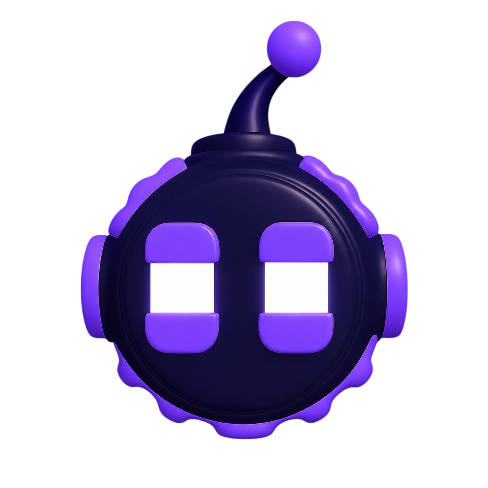

<div align="center">



# Oxie — AI Assistant

**A blazing-fast, streaming AI chat assistant for developers and creators.**  
Built with Next.js 16, React 19, Vercel AI SDK, and Framer Motion.

[](https://nextjs.org)
[](https://react.dev)
[](https://typescriptlang.org)
[](https://tailwindcss.com)
[](https://framer.com/motion)
[](LICENSE)

</div>

---

## ✨ Features

- 🤖 **Real-time Streaming Chat** — Token-by-token AI responses powered by the Vercel AI SDK
- ⚡ **Anthropic Claude Integration** — Claude Agent SDK for deep reasoning and multi-step tasks
- 🌐 **Web Search & Docs** — Live web access so Oxie answers questions about 2026 and beyond
- 💻 **Code Streaming** — Syntax-highlighted code blocks with `react-syntax-highlighter`
- 🎨 **Glassmorphic UI** — Premium dark interface with Framer Motion animations and glow effects
- 📱 **Fully Responsive** — Works seamlessly on desktop, tablet, and mobile
- 🔒 **Auth Pages** — Fast-loading static Sign In & Sign Up pages (zero JavaScript bundle)
- 🗂️ **Modular Architecture** — Clean component separation for easy maintenance

---

## 🖥️ App Pages

| Route | Description |
|---|---|
| `/` | Animated landing page with hero, feature cards, and navbar |
| `/chat` | Main AI chat interface with streaming responses |
| `/login` | Static Sign In page (server-rendered, instant load) |
| `/signup` | Static Sign Up page (server-rendered, instant load) |

---

## 🏗️ Project Structure

```
coder-ai/
├── public/
│   └── images/
│       ├── oxie.png          # Oxie bot logo
│       └── home-bg.jpg       # Landing page background
├── src/
│   ├── app/
│   │   ├── api/              # AI streaming API routes
│   │   ├── chat/             # Chat page
│   │   ├── login/            # Sign In page (static)
│   │   ├── signup/           # Sign Up page (static)
│   │   ├── globals.css       # Global styles & custom scrollbar
│   │   ├── layout.tsx        # Root layout with metadata
│   │   └── page.tsx          # Landing page (imports components)
│   ├── components/
│   │   ├── chat/             # MessageBubble, MessageList, ChatInput
│   │   ├── landing/          # Modular landing page components
│   │   │   ├── LandingBackground.tsx
│   │   │   ├── LandingHeader.tsx
│   │   │   ├── CenterHeroCore.tsx
│   │   │   ├── LeftHeroCards.tsx
│   │   │   ├── RightHeroCards.tsx
│   │   │   └── LandingFooter.tsx
│   │   ├── sidebar/          # Sidebar navigation
│   │   └── ui/               # Shared UI primitives (shadcn)
│   └── lib/
│       └── utils.ts          # cn() utility helper
```

---

## 🚀 Getting Started

### Prerequisites

- **Node.js** v18+
- **npm** v9+

### 1. Clone the repository

```bash
git clone https://github.com/CoderGUY47/FE-06-Streaming-AI-chat-ui.git
cd FE-06-Streaming-AI-chat-ui
```

### 2. Install dependencies

```bash
npm install
```

### 3. Set up environment variables

Create a `.env.local` file in the root directory:

```env
# Anthropic API Key
ANTHROPIC_API_KEY=your_anthropic_api_key_here

# OpenAI API Key (optional)
OPENAI_API_KEY=your_openai_api_key_here

# LangSmith (optional - for tracing)
LANGCHAIN_API_KEY=your_langsmith_api_key_here
LANGCHAIN_TRACING_V2=true
```

### 4. Start the development server

```bash
npm run dev
```

Open [http://localhost:3000](http://localhost:3000) in your browser.

---

## 🛠️ Tech Stack

| Category | Technology |
|---|---|
| **Framework** | Next.js 16 (App Router) |
| **Language** | TypeScript 5 |
| **UI Library** | React 19 |
| **Styling** | Tailwind CSS v4 |
| **Animations** | Framer Motion 12 |
| **AI SDK** | Vercel AI SDK 7 |
| **AI Model** | Anthropic Claude (Agent SDK) |
| **Icons** | React Icons, Lucide React |
| **Markdown** | react-markdown + remark-gfm |
| **Code Highlighting** | react-syntax-highlighter |
| **UI Primitives** | Radix UI + shadcn/ui |
| **Utilities** | clsx, tailwind-merge, zod |

---

## 📦 Scripts

```bash
npm run dev      # Start development server
npm run build    # Build for production
npm run start    # Start production server
```

---

## 🎨 Design Highlights

- **Full-screen background** with `home-bg.jpg` and a rich indigo gradient overlay
- **Animated logo** with a smooth floating motion (Framer Motion)
- **3-column hero layout** with Left / Center / Right feature cards
- **Glassmorphism cards** with backdrop blur and subtle borders
- **Custom scrollbar** styled to match the dark theme
- **Staggered entrance animations** on all landing page elements

---

## 📄 License

This project is licensed under the **MIT License**.

---

<div align="center">
  Made with ❤️ by <strong>CoderGUY47</strong>
</div>
